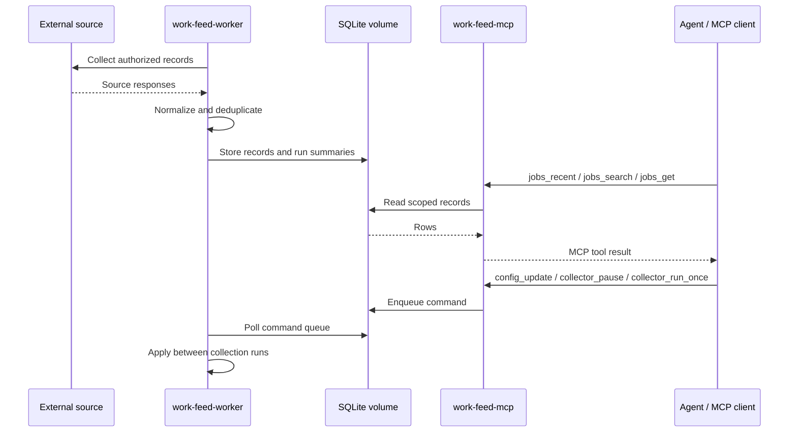

# work-feed-mcp

[](https://github.com/jaeyeopme/work-feed-mcp/actions/workflows/ci-cd.yml)
[](https://github.com/jaeyeopme/work-feed-mcp/actions/workflows/release.yml)
[](LICENSE)

Dockerized Python data-ingestion engine with SQLite storage and MCP tool access.

The project separates source collection, durable local storage, and agent-facing tools. It is useful as a small reference implementation for turning external records into scoped MCP tools with predictable JSON-safe outputs and explicit control boundaries.

The current reference source is public job-listing data. Operators are responsible for using only sources they are authorized to collect and process. This project is not affiliated with, endorsed by, or sponsored by Upwork Inc.

License: MIT. See `CONTRIBUTING.md`, `SECURITY.md`, and `CHANGELOG.md` for maintainer notes.



This is not a REST web app, application bot, proposal generator, auto-apply tool, or built-in recommendation engine. It does not provide credentials, cookies, proxy bypasses, application automation, ranking logic, or raw upstream private payloads.

## Quick start

The normal user path is Docker Compose. It starts two services:

- `work-feed-worker`: runs the live collection loop and writes to SQLite.
- `work-feed-mcp`: exposes MCP tools over the same SQLite database.

```bash
git clone https://github.com/jaeyeopme/work-feed-mcp.git
cd work-feed-mcp
cp .env.example .env
docker compose up -d --build
docker compose ps
```

Configuration lives in `.env`. The defaults are conservative and work without credentials or cookies.

| Variable                     | Default                  | Meaning                                                                                     |
| ---------------------------- | ------------------------ | ------------------------------------------------------------------------------------------- |
| `WORK_FEED_LIVE`             | `1`                      | Enable visitor-mode live collection in Docker. Set to `0` only for local debugging.         |
| `WORK_FEED_DB`               | `/data/work-feed.sqlite` | SQLite path inside the Docker volume.                                                       |
| `WORK_FEED_INTERVAL_SECONDS` | `3600`                   | Wait time between worker collection runs.                                                   |
| `WORK_FEED_MAX_PAGES`        | `5`                      | Maximum pages per run.                                                                      |
| `WORK_FEED_PAGE_SIZE`        | `50`                     | Jobs requested per page.                                                                    |
| `WORK_FEED_QUERIES`          | empty                    | Optional comma-separated searches such as `python,scraping`; empty means unfiltered/latest. |
| `WORK_FEED_LOG_LEVEL`        | `INFO`                   | Worker log level.                                                                           |
| `WORK_FEED_MCP_HOST`         | `0.0.0.0`                | Container bind host for the MCP server.                                                     |
| `WORK_FEED_MCP_PORT`         | `8000`                   | Host port for the local MCP endpoint.                                                       |
| `WORK_FEED_MCP_PATH`         | `/mcp`                   | HTTP path for Streamable HTTP MCP.                                                          |

By default each run collects up to 250 jobs: `5 pages * 50 jobs`. After changing `.env`, recreate the services so Docker applies the new environment:

```bash
docker compose up -d --force-recreate
```

## Connect an MCP client

The Docker Compose runtime exposes a **Streamable HTTP MCP** endpoint, not a REST API.

Default endpoint:

```text
http://127.0.0.1:8000/mcp
```

If you override Compose env, derive it as:

```text
http://127.0.0.1:${WORK_FEED_MCP_PORT:-8000}${WORK_FEED_MCP_PATH:-/mcp}
```

Docker health checks prove container readiness and HTTP transport reachability for `/mcp`. They do **not** run a full MCP protocol initialize / tools/list / tool-call smoke. Run a protocol-level smoke from your MCP client if you need that evidence.

### Claude Code

Use Claude Code's HTTP MCP transport. Local scope is usually best for a personal Docker runtime because it stays private to your machine and current project.

```bash
claude mcp add --transport http work-feed http://127.0.0.1:8000/mcp
claude mcp list
```

Inside Claude Code, run:

```text
/mcp
```

If you want a project-scoped config instead, Claude Code can write a `.mcp.json` file:

```bash
claude mcp add --transport http --scope project work-feed http://127.0.0.1:8000/mcp
```

The equivalent JSON shape is:

```json
{
  "mcpServers": {
    "work-feed": {
      "type": "http",
      "url": "http://127.0.0.1:8000/mcp"
    }
  }
}
```

Claude Code also accepts `streamable-http` as a JSON alias for `http`, but the CLI examples above use `http` because that is the documented Claude Code command syntax.

### Codex

Use Codex's streamable HTTP MCP support. The CLI writes the shared Codex config used by the CLI and IDE extension.

```bash
codex mcp add work-feed --url http://127.0.0.1:8000/mcp
codex mcp list
```

The equivalent `~/.codex/config.toml` entry is:

```toml
[mcp_servers.work-feed]
url = "http://127.0.0.1:8000/mcp"
```

Codex infers streamable HTTP from `url`; do not add Claude-style `type` or `transport` fields to the TOML entry.

After connecting, ask your agent to call `jobs_recent` with `limit: 5` to confirm the MCP server responds. An empty result is okay on a fresh database. For a protocol-level check against a running MCP server, run:

```bash
make mcp-smoke
```

## Operate the runtime

```bash
docker compose ps
docker compose logs -f
docker compose restart
docker compose down
docker compose config
docker compose exec work-feed-worker work-feed scheduler-status --db /data/work-feed.sqlite
```

Convenience wrappers are available when `make` is installed:

```bash
make status
make logs
make restart
make down
make config
make mcp-smoke
```

## MCP tools

Job reads:

- `jobs_recent`
- `jobs_search`
- `jobs_get`

Run/status reads:

- `runs_recent`
- `collector_status`

Config/control queue:

- `config_get`
- `config_update`
- `collector_run_once`
- `collector_pause`
- `collector_resume`
- `collector_command_status`

Control tools are **enqueue-only**. They return immediately with a command id; the worker applies commands between collection runs.

```json
{ "ok": true, "command_id": "...", "status": "queued" }
```

Poll completion with `collector_command_status(command_id)`. Terminal states are `applied` and `failed`; in-flight states are `queued` and `running`.

`config_update` follows the same queue path and only accepts:

- `interval_seconds`
- `queries`
- `max_pages`
- `page_size`
- `paused`

Live collection mode is set by Docker/.env at startup. MCP tools can pause/resume the worker and update schedule, query, and page settings, but they cannot switch the runtime between live and non-live modes.

Config precedence:

```text
1. worker startup seeds missing collector_config keys from Compose/.env
2. existing persisted keys are preserved across restarts
3. MCP config_update changes persisted keys through the command queue
4. Docker live mode remains an env/bootstrap setting
```

If MCP starts before the worker initializes SQLite, tools return stable `not_ready` payloads instead of creating schema from the read path:

```json
{
  "ok": false,
  "error": "not_ready",
  "reason": "db_missing",
  "next_action": "start work-feed-worker"
}
```

`reason` may be `db_missing`, `schema_missing`, or `unsupported_schema`. For `unsupported_schema`, upgrade work-feed or migrate the database before reading or controlling the runtime. An initialized DB with no rows is not an error; list tools return `{ "ok": true, "status": "empty", "rows": [] }`.

## Run counts and dedupe

Collector status and run history use three counters:

- `seen`: rows observed or fetched during a run.
- `inserted`: newly stored unique jobs.
- `skipped`: observed rows not stored because a job with the same identity already exists.

Stored jobs are deduplicated by `job_id`. A high `skipped` count usually means the collector saw jobs already saved in the database; it is not a failure by itself.

## What this does not do

- Not a REST API.
- Not a recommendation engine.
- Not auto-apply.
- Not proposal/message generation.
- Not notifications or report delivery.
- Not proxy/bypass tooling.
- Not cookie/session based collection guidance.
- Not raw upstream private payload storage.

## Troubleshooting

Empty results after a fresh start usually mean the database is initialized but no jobs have been collected yet. This is a valid empty state.

If an MCP tool returns `not_ready`, check that `work-feed-worker` is running and healthy:

```bash
docker compose ps
docker compose logs -f work-feed-worker
```

For MCP connection failures, confirm the endpoint and local port:

```bash
docker compose ps work-feed-mcp
docker compose logs -f work-feed-mcp
```

Default endpoint:

```text
http://127.0.0.1:8000/mcp
```

If `.env` changes do not appear, recreate the services:

```bash
docker compose up -d --force-recreate
```

If upstream collection is blocked or unavailable, keep the runtime running and inspect collector status and logs. Worker resilience for blocked upstream states is tracked as a separate follow-up; this README documents the current operational condition.

## Project structure

Runtime flow:

```text
Docker Compose
  work-feed-worker  -> recurring visitor collection -> SQLite volume
  work-feed-mcp     -> Streamable HTTP MCP tools -> agent client
```

Internal Python layout:

```text
src/work_feed_mcp/integrations/upwork  Upwork visitor collection and normalization
src/work_feed_mcp/services             collection, ingestion, analytics, health use cases
src/work_feed_mcp/repositories         SQLite query/persistence helpers
src/work_feed_mcp/db                   SQLite schema/connection helpers
src/work_feed_mcp/domain               normalized collector contracts
src/work_feed_mcp/runtime              collector worker runtime
src/work_feed_mcp/mcp_server           agent-facing MCP tools
src/work_feed_mcp/cli                  local/debug CLI entrypoints
```

Core flow:

```text
integrations/upwork
  -> services/scheduled_collection
  -> SQLite repositories/db
  -> services/analytics and MCP tools
```

## Developer reference

Development checks are maintained for contributors and local maintenance; they are not required for normal Docker/MCP usage.

Contributor and release references:

- `docs/PRD.md` for current product requirements and non-goals.
- `docs/ARCHITECTURE.md` for runtime, layer, data-flow, and release architecture.
- `docs/TRD.md` for technical requirements, contracts, and verification gates.
- `docs/adr/` for accepted architecture decisions.
- `CONTRIBUTING.md` for setup, verification, scope boundaries, and PR expectations.
- `SECURITY.md` for vulnerability reporting and safe diagnostic rules.
- `CHANGELOG.md` for release notes.

```bash
make quality
make architecture
make coverage
make smoke
make e2e-smoke
make docker-compose-config
```

`make quality` runs formatting, linting, strict type checks, import architecture contracts, and tests. `make architecture` runs only the import-boundary contracts. `make coverage` enforces the current conservative coverage gate at 80% without publishing a badge or using an external service.

The `ci-cd` workflow runs the same quality, coverage, smoke, and e2e smoke checks on pull requests and pushes. To inspect local test coverage directly, run:

```bash
make coverage
```

Direct Python CLI entrypoints exist for local debugging, but they are not the normal user interface. Prefer Docker/MCP for normal use.

```bash
uv run work-feed --help
uv run work-feed worker --help
uv run work-feed mcp-server --help
```

Live collection evidence should be reported separately from local contract checks.

## Agent context

Use these docs as source of truth when giving this repo to another agent:

- `docs/PRD.md`
- `docs/ARCHITECTURE.md`
- `docs/TRD.md`
- `docs/adr/`

Boundary reminder for agents:

- Collection stays dumb and secret-safe.
- SQLite persistence belongs in repository/db/service code.
- Analytics and MCP read SQLite only.
- Recommendation/ranking belongs outside this data engine unless explicitly promoted later.
