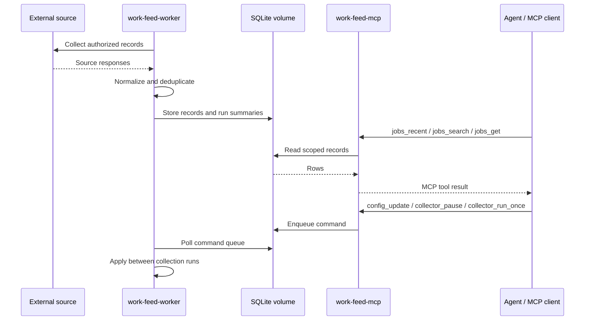

# work-feed-mcp

[](https://github.com/jaeyeopme/work-feed-mcp/actions/workflows/ci-cd.yml)
[](https://github.com/jaeyeopme/work-feed-mcp/actions/workflows/release.yml)
[](LICENSE)

Dockerized Python data-ingestion engine with SQLite storage and MCP tool access.

The project separates source collection, durable local storage, and agent-facing tools. It is useful as a small reference implementation for turning external records into scoped MCP tools with predictable JSON-safe outputs and explicit control boundaries.

The current reference source is public job-listing data. Operators are responsible for using only sources they are authorized to collect and process. This project is not affiliated with, endorsed by, or sponsored by Upwork Inc.

License: MIT. See `CONTRIBUTING.md`, `SECURITY.md`, and `CHANGELOG.md` for maintainer notes.



This is not a REST web app, application bot, proposal generator, auto-apply tool, or built-in recommendation engine. It does not provide credentials, cookies, proxy bypasses, application automation, ranking logic, or raw upstream private payloads.

## Quick start

Prerequisites: Docker Desktop or Docker Engine with Docker Compose v2. Normal usage does
not require a local Python toolchain.

The normal user path is Docker Compose. It starts two services:

- `work-feed-worker`: runs the live collection loop and writes to SQLite.
- `work-feed-mcp`: exposes MCP tools over the same SQLite database.

### 1. Start it

```bash
git clone https://github.com/jaeyeopme/work-feed-mcp.git
cd work-feed-mcp
cp .env.example .env
docker compose up -d --build
```

### 2. Check it

```bash
docker compose ps
```

Expected result:

- `work-feed-worker` is running.
- `work-feed-mcp` is running.
- Health may stay `starting` briefly on first boot while SQLite is initialized.
- A fresh database can return empty job lists until collection stores rows.

### 3. Connect it

Use this Streamable HTTP MCP endpoint in your client:

```text
http://127.0.0.1:8000/mcp
```

After connecting, ask your agent to call `jobs_recent` with `limit: 5`. An empty result is
okay on a fresh database.

Configuration lives in `.env`. The defaults are conservative and work without credentials or cookies.
Most users can start without editing it. To target specific searches, edit only
`WORK_FEED_QUERIES`, for example:

```dotenv
WORK_FEED_QUERIES=python,scraping,automation
```

Then recreate the services:

```bash
docker compose up -d --force-recreate
```

| Variable                     | Default                  | Meaning                                                                                     |
| ---------------------------- | ------------------------ | ------------------------------------------------------------------------------------------- |
| `WORK_FEED_LIVE`             | `1`                      | Enable visitor-mode live collection in Docker. Set to `0` only for local debugging.         |
| `WORK_FEED_DB`               | `/data/work-feed.sqlite` | SQLite path inside the Docker volume.                                                       |
| `WORK_FEED_INTERVAL_SECONDS` | `3600`                   | Wait time between worker collection runs.                                                   |
| `WORK_FEED_MAX_PAGES`        | `5`                      | Maximum pages per run.                                                                      |
| `WORK_FEED_PAGE_SIZE`        | `50`                     | Jobs requested per page.                                                                    |
| `WORK_FEED_QUERIES`          | empty                    | Optional comma-separated searches; empty means unfiltered/latest.                           |
| `WORK_FEED_LOG_LEVEL`        | `INFO`                   | Worker log level.                                                                           |
| `WORK_FEED_MCP_HOST`         | `0.0.0.0`                | Container bind host for the MCP server.                                                     |
| `WORK_FEED_MCP_PORT`         | `8000`                   | Host port for the local MCP endpoint.                                                       |
| `WORK_FEED_MCP_PATH`         | `/mcp`                   | HTTP path for Streamable HTTP MCP.                                                          |

By default each run collects up to 250 jobs: `5 pages * 50 jobs`.

## Connect an MCP client

The Docker Compose runtime exposes a **Streamable HTTP MCP** endpoint, not a REST API.

Use these values in any MCP client that supports Streamable HTTP:

| Field | Value |
| --- | --- |
| Name | `work-feed` |
| Transport | Streamable HTTP, sometimes shown as HTTP |
| URL | `http://127.0.0.1:8000/mcp` |

If you override Compose env, derive it as:

```text
http://127.0.0.1:${WORK_FEED_MCP_PORT:-8000}${WORK_FEED_MCP_PATH:-/mcp}
```

Use the client's HTTP/Streamable HTTP option, not a stdio command. Client-specific
config formats vary, but a typical shape is:

```json
{
  "mcpServers": {
    "work-feed": {
      "url": "http://127.0.0.1:8000/mcp"
    }
  }
}
```

Docker health checks prove container readiness and HTTP transport reachability for `/mcp`. They do **not** run a full MCP protocol initialize / tools/list / tool-call smoke.

After connecting, ask your agent to call `jobs_recent` with `limit: 5` to confirm the MCP server responds. An empty result is okay on a fresh database.

For a Docker-only protocol-level smoke against the running MCP server, run:

```bash
docker compose exec work-feed-mcp work-feed mcp-smoke
```

## Operate the runtime

| Need | Command |
| --- | --- |
| See containers | `docker compose ps` |
| Follow logs | `docker compose logs -f` |
| Restart after `.env` edits | `docker compose up -d --force-recreate` |
| Restart containers | `docker compose restart` |
| Stop containers | `docker compose down` |
| Validate Compose config | `docker compose config` |
| Check scheduler state | `docker compose exec work-feed-worker work-feed scheduler-status --db /data/work-feed.sqlite` |
| Run MCP protocol smoke | `docker compose exec work-feed-mcp work-feed mcp-smoke` |

## MCP tools

Job reads:

- `jobs_recent`
- `jobs_search`
- `jobs_get`

Run/status reads:

- `runs_recent`
- `collector_status`

Config/control queue:

- `config_get`
- `config_update`
- `collector_run_once`
- `collector_pause`
- `collector_resume`
- `collector_command_status`

Control tools are **enqueue-only**. They return immediately with a command id; the worker applies commands between collection runs.

```json
{ "ok": true, "command_id": "...", "status": "queued" }
```

Poll completion with `collector_command_status(command_id)`. Terminal states are `applied` and `failed`; in-flight states are `queued` and `running`.

`config_update` follows the same queue path and only accepts:

- `interval_seconds`
- `queries`
- `max_pages`
- `page_size`
- `paused`

Live collection mode is set by Docker/.env at startup. MCP tools can pause/resume the worker and update schedule, query, and page settings, but they cannot switch the runtime between live and non-live modes.

Config precedence:

```text
1. worker startup seeds missing collector_config keys from Compose/.env
2. existing persisted keys are preserved across restarts
3. MCP config_update changes persisted keys through the command queue
4. Docker live mode remains an env/bootstrap setting
```

If MCP starts before the worker initializes SQLite, tools return stable `not_ready` payloads instead of creating schema from the read path:

```json
{
  "ok": false,
  "error": "not_ready",
  "reason": "db_missing",
  "details": "database file does not exist",
  "next_action": "start work-feed-worker"
}
```

`reason` may be `db_missing`, `schema_missing`, or `unsupported_schema`; `details` gives a safe short explanation for the reason. For `unsupported_schema`, upgrade work-feed or migrate the database before reading or controlling the runtime. An initialized DB with no rows is not an error; list tools return `{ "ok": true, "status": "empty", "rows": [] }`.

## Run counts and dedupe

Collector status and run history use three counters:

- `seen`: rows observed or fetched during a run.
- `inserted`: newly stored unique jobs.
- `skipped`: observed rows not stored because a job with the same identity already exists.

Stored jobs are deduplicated by `job_id`. A high `skipped` count usually means the collector saw jobs already saved in the database; it is not a failure by itself.

## What this does not do

- Not a REST API.
- Not a recommendation engine.
- Not auto-apply.
- Not proposal/message generation.
- Not notifications or report delivery.
- Not proxy/bypass tooling.
- Not cookie/session based collection guidance.
- Not raw upstream private payload storage.

## Troubleshooting

Empty results after a fresh start usually mean the database is initialized but no jobs have been collected yet. This is a valid empty state.

If an MCP tool returns `not_ready`, check that `work-feed-worker` is running and healthy:

```bash
docker compose ps
docker compose logs -f work-feed-worker
```

The `work-feed scheduler-status` command also prints parseable `not_ready` JSON and exits with code 2 when the database is missing, schema-less, or newer than this build supports. It does not create or migrate the SQLite schema from the read path.

For MCP connection failures, confirm the endpoint and local port:

```bash
docker compose ps work-feed-mcp
docker compose logs -f work-feed-mcp
```

Default endpoint:

```text
http://127.0.0.1:8000/mcp
```

If `.env` changes do not appear, recreate the services:

```bash
docker compose up -d --force-recreate
```

If upstream collection is blocked, rate limited, temporarily unavailable, or malformed, the worker keeps running after recording the failed run with redacted diagnostics. Inspect collector status and logs, then retry later or adjust collection settings if needed.

## Project structure

Runtime tree:

```text
work-feed-mcp
|-- compose.yaml
|   |-- work-feed-worker  collects authorized records and writes SQLite
|   `-- work-feed-mcp     exposes Streamable HTTP MCP at /mcp
|-- .env                  user runtime settings
`-- work-feed-data        Docker volume with /data/work-feed.sqlite
```

Data flow:

```text
authorized source
`-- integrations/upwork
    `-- services/scheduled_collection
        |-- repositories + db
        |   `-- SQLite jobs, run history, command queue
        `-- mcp_server/tools
            `-- MCP client
```

Python package tree:

```text
src/work_feed_mcp/
|-- integrations/upwork/  source collection, credential redaction, normalization
|-- services/             collection, ingestion, analytics, health use cases
|-- repositories/         SQLite query and persistence helpers
|-- db/                   SQLite schema and connection policy
|-- domain/               normalized collector contracts
|-- runtime/              Docker worker runtime
|-- mcp_server/           agent-facing MCP tools
`-- cli/                  local/debug entrypoints
```

## Developer reference

Development checks are maintained for contributors and local maintenance; they are not required for normal Docker/MCP usage.

Contributor and release references:

- `docs/PRD.md` for current product requirements and non-goals.
- `docs/ARCHITECTURE.md` for runtime, layer, data-flow, and release architecture.
- `docs/TRD.md` for technical requirements, contracts, and verification gates.
- `docs/adr/` for accepted architecture decisions.
- `CONTRIBUTING.md` for setup, verification, scope boundaries, and PR expectations.
- `SECURITY.md` for vulnerability reporting and safe diagnostic rules.
- `CHANGELOG.md` for release notes.

Contributor setup and verification commands live in `CONTRIBUTING.md`. The `ci-cd`
workflow runs quality, coverage, smoke, and e2e smoke checks on pull requests and
pushes. Coverage is intentionally kept as a conservative 80% gate without
publishing a badge or using an external service.

Direct Python CLI entrypoints exist for local debugging, but they are not the normal
user interface. Prefer Docker/MCP for normal use.

Live collection evidence should be reported separately from local contract checks.

## Agent context

Use these docs as source of truth when giving this repo to another agent:

- `docs/PRD.md`
- `docs/ARCHITECTURE.md`
- `docs/TRD.md`
- `docs/adr/`

Boundary reminder for agents:

- Collection stays dumb and secret-safe.
- SQLite persistence belongs in repository/db/service code.
- Analytics and MCP read SQLite only.
- Recommendation/ranking belongs outside this data engine unless explicitly promoted later.
