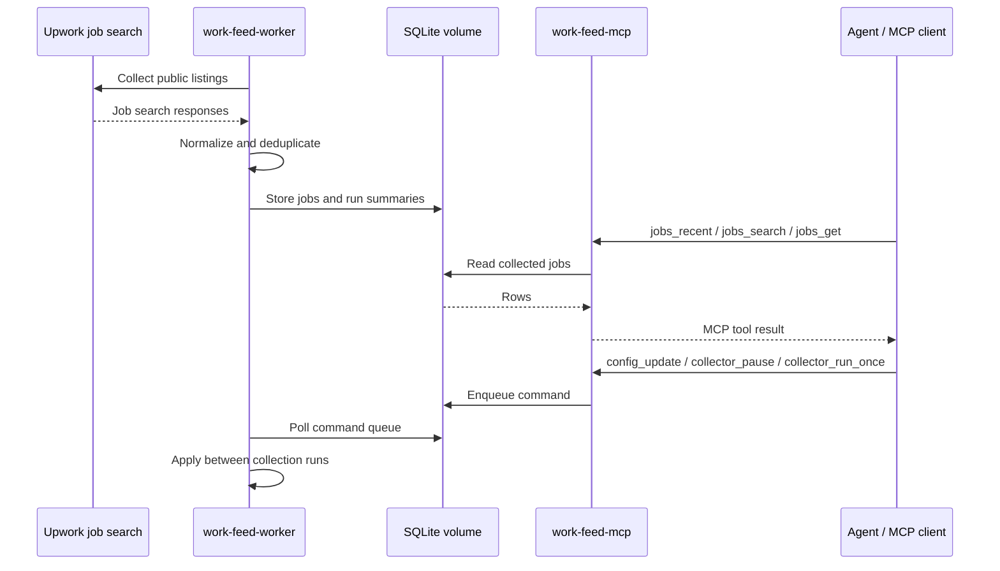

# work-feed-mcp

Docker/MCP-first local data engine for collecting Upwork job listings into SQLite and exposing them to agents through MCP.

This project is not affiliated with, endorsed by, or sponsored by Upwork Inc. Upwork is referenced only as the source platform for collected public job listings.



This is not a REST web app, application bot, proposal generator, auto-apply tool, or built-in recommendation engine.

## Quick start

The normal user path is Docker Compose. It starts two services:

- `work-feed-worker`: runs the live collection loop and writes to SQLite.
- `work-feed-mcp`: exposes MCP tools over the same SQLite database.

```bash
cp .env.example .env
make up
make status
```

Configuration lives in `.env`. The defaults are conservative and work without credentials or cookies.

| Variable | Default | Meaning |
| --- | --- | --- |
| `WORK_FEED_LIVE` | `1` | Enable visitor-mode live collection in Docker. Set to `0` only for local debugging. |
| `WORK_FEED_DB` | `/data/work-feed.sqlite` | SQLite path inside the Docker volume. |
| `WORK_FEED_INTERVAL_SECONDS` | `3600` | Wait time between worker collection runs. |
| `WORK_FEED_MAX_PAGES` | `5` | Maximum pages per run. |
| `WORK_FEED_PAGE_SIZE` | `50` | Jobs requested per page. |
| `WORK_FEED_QUERIES` | empty | Optional comma-separated searches such as `python,scraping`; empty means unfiltered/latest. |
| `WORK_FEED_LOG_LEVEL` | `INFO` | Worker log level. |
| `WORK_FEED_MCP_HOST` | `0.0.0.0` | Container bind host for the MCP server. |
| `WORK_FEED_MCP_PORT` | `8000` | Host port for the local MCP endpoint. |
| `WORK_FEED_MCP_PATH` | `/mcp` | HTTP path for Streamable HTTP MCP. |
| `WORK_FEED_MCP_TRANSPORT` | `streamable-http` | MCP transport used by the container. |

By default each run collects up to 250 jobs: `5 pages * 50 jobs`. After changing `.env`, restart the runtime:

```bash
make restart
```

## Connect an MCP client

Default endpoint:

```text
http://127.0.0.1:8000/mcp
```

If you override Compose env, derive it as:

```text
http://127.0.0.1:${WORK_FEED_MCP_PORT:-8000}${WORK_FEED_MCP_PATH:-/mcp}
```

See [MCP client setup](docs/mcp-client-setup.md) for a generic Streamable HTTP MCP client config.

## Operate the runtime

```bash
make status   # container status
make logs     # follow worker + MCP logs
make restart  # restart both services
make down     # stop the runtime
make config   # render docker compose config
```

## MCP tools

Job reads:

- `jobs_recent`
- `jobs_search`
- `jobs_get`

Run/status reads:

- `runs_recent`
- `collector_status`

Config/control queue:

- `config_get`
- `config_update`
- `collector_run_once`
- `collector_pause`
- `collector_resume`
- `collector_command_status`

Control tools are **enqueue-only**. They return immediately with a command id; the worker applies commands between collection runs.

```json
{ "ok": true, "command_id": "...", "status": "queued" }
```

Poll completion with `collector_command_status(command_id)`. Terminal states are `applied` and `failed`; in-flight states are `queued` and `running`.

`config_update` follows the same queue path and only accepts:

- `interval_seconds`
- `queries`
- `max_pages`
- `page_size`
- `paused`

Live collection mode is set by Docker/.env at startup. MCP tools can pause/resume the worker and update schedule, query, and page settings, but they cannot switch the runtime between live and non-live modes.

Config precedence:

```text
1. worker startup seeds missing collector_config keys from Compose/.env
2. existing persisted keys are preserved across restarts
3. MCP config_update changes persisted keys through the command queue
4. Docker live mode remains an env/bootstrap setting
```

If MCP starts before the worker initializes SQLite, tools return stable `not_ready` payloads instead of creating schema from the read path:

```json
{ "ok": false, "error": "not_ready", "reason": "db_missing", "next_action": "start work-feed-worker" }
```

`reason` may be `db_missing` or `schema_missing`. An initialized DB with no rows is not an error; list tools return `{ "ok": true, "status": "empty", "rows": [] }`.

## What this does not do

- Not a REST API.
- Not a recommendation engine.
- Not auto-apply.
- Not proposal/message generation.
- Not notifications or report delivery.
- Not proxy/bypass tooling.
- Not cookie/session based collection guidance.

## Project structure

Runtime flow:

```text
Docker Compose
  work-feed-worker  -> recurring visitor collection -> SQLite volume
  work-feed-mcp     -> Streamable HTTP MCP tools -> agent client
```

Internal Python layout:

```text
src/work_feed_mcp/integrations/upwork  Upwork visitor collection and normalization
src/work_feed_mcp/services             collection, ingestion, analytics, health use cases
src/work_feed_mcp/repositories         SQLite query/persistence helpers
src/work_feed_mcp/db                   SQLite schema/connection helpers
src/work_feed_mcp/domain               normalized collector contracts
src/work_feed_mcp/runtime              collector worker runtime
src/work_feed_mcp/mcp_server           agent-facing MCP tools
src/work_feed_mcp/cli                  local/debug CLI entrypoints
```

Core flow:

```text
integrations/upwork
  -> services/scheduled_collection
  -> SQLite repositories/db
  -> services/analytics and MCP tools
```

## Developer reference

Development checks are maintained for contributors and local maintenance; they are not required for normal Docker/MCP usage.

```bash
make quality
make smoke
make e2e-smoke
make docker-compose-config
```

Direct Python CLI entrypoints exist for local debugging, but they are not the normal user interface. Prefer Docker/MCP for normal use.

```bash
uv run work-feed --help
uv run work-feed worker --help
uv run work-feed mcp-server --help
```

Live collection evidence should be reported separately from local contract checks.

## Agent context

Use these docs as source of truth when giving this repo to another agent:

- `docs/LLM_CONTEXT.md`
- `docs/EXTERNAL_LLM_GUIDE.md`
- `docs/contracts/job-jsonl.md`

Boundary reminder for agents:

- Collection stays dumb and secret-safe.
- SQLite persistence belongs in repository/db/service code.
- Analytics and MCP read SQLite only.
- Recommendation/ranking belongs outside this data engine unless explicitly promoted later.
